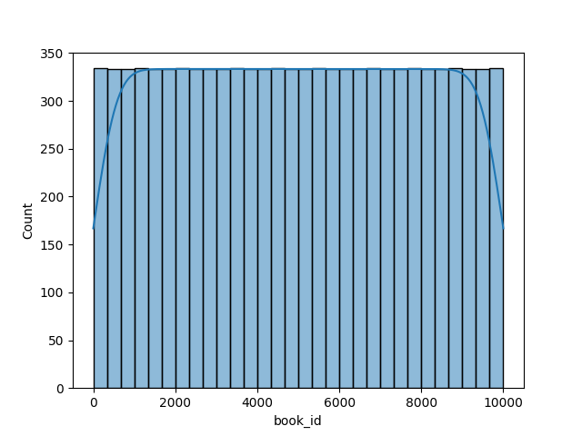
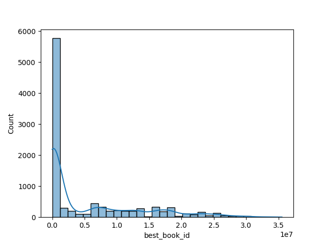
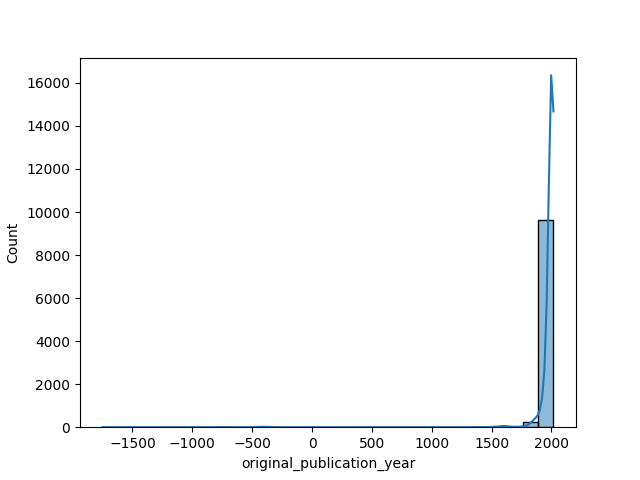
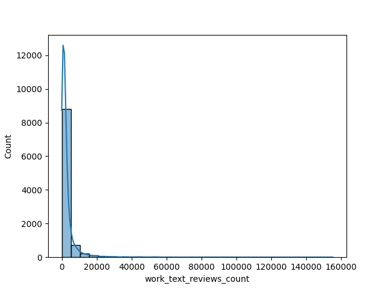
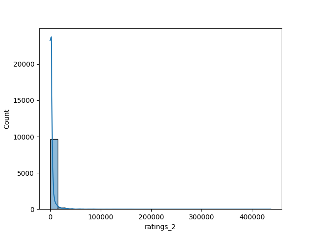

# Automated Data Analysis

### 1. Dataset Overview

The dataset comprises 10,000 entries representing various books, intended primarily for literary analysis or recommender system development. Each entry includes multiple attributes related to the book's metadata and user interactions. 

**Structure:**
- The dataset consists of 23 columns, encompassing a mix of numerical, categorical, and text-based information.
  
**Variable Types:**
- **Integer:** `book_id`, `goodreads_book_id`, `best_book_id`, `work_id`, `books_count`, `ratings_count`, `work_ratings_count`, `work_text_reviews_count`, `ratings_1`, `ratings_2`, `ratings_3`, `ratings_4`, `ratings_5`
- **Float:** `isbn13`, `original_publication_year`, `average_rating`
- **Object (String):** `isbn`, `authors`, `original_title`, `title`, `language_code`, `image_url`, `small_image_url`

**Missing Values:**
- Several attributes contain missing values, notably `isbn` (700), `isbn13` (585), `original_publication_year` (21), `original_title` (585), and `language_code` (1084).

### 2. Exploratory Analysis

**Methods Used:**
- Summary statistics were generated to analyze the distribution of numerical variables.
- Counts of unique entries and missing values were tallied to evaluate data completeness.
- Data type examinations confirmed the integrity of variable types.

**Data Quality Issues:**
- **Missing Values:** Multiple fields show missing entries; particularly concerning is the high number of missing `language_code` values, which could impact user information and recommendations.
- **Outliers:** Outlying data (e.g., extremely high values in rating counts) may skew analysis results, warranting further examination.
- **Duplicates:** No duplicates were flagged in this report, which indicates data uniqueness.

### 3. Feature Relationships

**Correlations:**
- The average rating (average_rating) shows a positive correlation with `ratings_count` and `work_ratings_count`, indicating that books with higher user ratings tend to attract more reviews.
  
**Patterns:**
- The `authors` field reveals an interesting distribution, with some authors (e.g., Stephen King) having multiple entries, which could suggest popularity or prolificacy.

### 4. Key Insights

- The average rating across entries appears satisfactory, with a mean of approximately 3.9.
- A significant number of books seem to be published between the 1990s and the early 2000s, suggesting a surge in the publication of popular titles during that period.
- **Authors' Influence:** Specific authors dominate the "ratings" columns, indicating a potential marketing or promotion opportunity.

### 5. Implications

The dataset highlights several areas of action:
- **Improvements in Data Quality:** Efforts should be directed towards filling missing values, particularly in `isbn` and `language_code`, essential for international audiences. Tools like imputation methods could be leveraged.
- **User Insights for Recommendations:** Insights into authors and ratings can help refine recommendation algorithms, focusing on books with high engagement but lower visibility.

### 6. Visualizations

**Significance of Visualizations:**
1. **Distribution of Ratings:** A histogram showing the distribution of `average_rating` can reveal the average quality of books in this dataset and identifies if most books cluster around specific ratings.
2. **Publication Year Trends:** A line chart showcasing the number of books published per year can help highlight trends in the publishing industry over time.
3. **Author Popularity:** A bar chart representing the top authors by `ratings_count` would visualize the market's engagement with different authors.

### 7. Hypotheses

Based on the analysis, several hypotheses can be proposed for further investigation:
1. **Rating and Review Impact:** Does a book’s average rating correlate more strongly with the number of ratings received, or the work's uniqueness (i.e., how often an author publishes)?
2. **Language Distribution:** How does the missing `language_code` impact the `ratings_count` and `average_rating` for books across different regions?
3. **Publication Date Influence:** Is there a measurable trend in the average rating of books relative to their original publication year? Are newer books rated more favorably compared to older ones?

These exploratory questions can drive further analysis and contribute to a richer understanding of the dataset.

