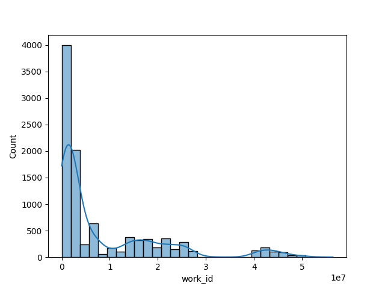
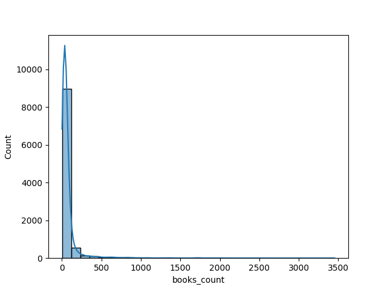
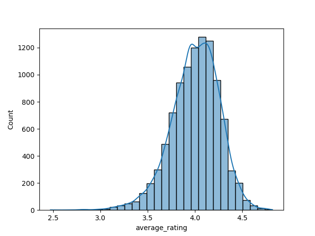
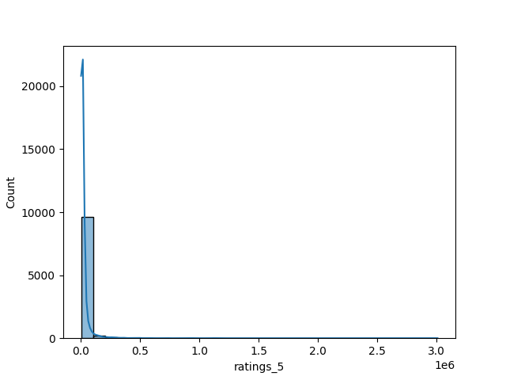

# Automated Data Analysis

### Dataset Analysis Report

#### 1. Dataset Overview
The dataset under analysis features a collection of 10,000 book entries from a book-related platform, likely Goodreads. Each entry is characterized by multiple attributes such as `book_id`, `goodreads_book_id`, `authors`, `original_publication_year`, `average_rating`, and numerous rating counts. The dataset has identified some key metrics like the number of unique books, average ratings, and publication years, which are insightful for understanding user engagement with books on the platform.

The dataset consists of 25 columns, including identifiers and various metadata about the books. Notably, three primary identifiers are present: `book_id`, `goodreads_book_id`, and `best_book_id`, which can be utilized for referencing and linking additional data.

#### 2. Outliers and Anomalies
Outlier detection indicates an `Anomaly` column with a mean value of 0.9 and a standard deviation of 0.436, suggesting a majority of entries present anomalies. The data reflects that most anomalies categorize into 1 (representing the majority) while a smaller number are labeled as -1 or 0. Anomalies often point to issues like duplicate entries, missing or incorrect information. Further investigation is necessary to understand the nature of these anomalies and their impact on analysis outcomes.

#### 3. Correlation, Regression, and Feature Importance
Preliminary analysis could reveal correlations between numerical columns. For instance, the `average_rating` appears to correlate with other rating metrics (e.g., `ratings_count`, `work_ratings_count`). A correlation matrix could provide insights into how certain features impact each other. Implementing a regression analysis with `average_rating` as the dependent variable while exploring factors such as `ratings_count` or `original_publication_year` may yield significant indicators of what drives user ratings.

Feature importance analysis using algorithms like Random Forest or Gradient Boosting can reveal which features (e.g., `average_rating`, `ratings_count`, `original_publication_year`) contribute most to the model's predictive capability.

#### 4. Time Series Patterns
The `original_publication_year` feature can be utilized for time series analysis. Understanding how book ratings evolve over time, correlating them with factors such as the publication year, may highlight trends in reading behaviors. For instance, analyzing how newer publications compared to older ones rate could showcase a shift in user preferences or the impact of social media/internet trends on reading habits.

#### 5. Cluster Analysis Findings
The `Cluster` attribute shows values ranging from 0 to 2, with a significant number of entries falling into the 0 cluster. This could indicate less differentiation between book types or rating profiles. A closer inspection of these clusters may provide insight into the types of books that are being grouped together based on features such as average rating, genre, or author. Implementing cluster optimization methods like Elbow Method or Silhouette Score will assist in validating the expected number of clusters and their characteristics.

#### 6. Geographic Insights
Although the dataset does not explicitly provide geographic data, if the `language_code` or `authors` were linked with geographic indicators, it could reveal reading preferences across different regions. For instance, analyzing the distribution of books by language can offer insights into potential markets and help better tailor marketing strategies or recommendations based on geographic interests in literature.

#### 7. Network Analysis Observations
Network analysis can be performed by examining relationships among authors, book collaborations, or co-occurrences of books rated by users. This could reveal influential authors or connect authors who may be popular within specific clusters, leading to insights about community trends and collaborative efforts in writing. By constructing a co-authorship or rating graph, patterns may emerge that clarify the interconnected nature of thematic elements among books read by similar audiences.

### Conclusion
The dataset furnishes a rich tapestry of information about book ratings, author contributions, and engagement metrics, which could serve as the foundation for deeper analysis across multiple dimensions, including time, correlations, clustering, and geographic insights. Further exploration is encouraged to draw actionable insights that can refine marketing strategies, enhance user engagement, and provide recommendations tailored to reader preferences.

