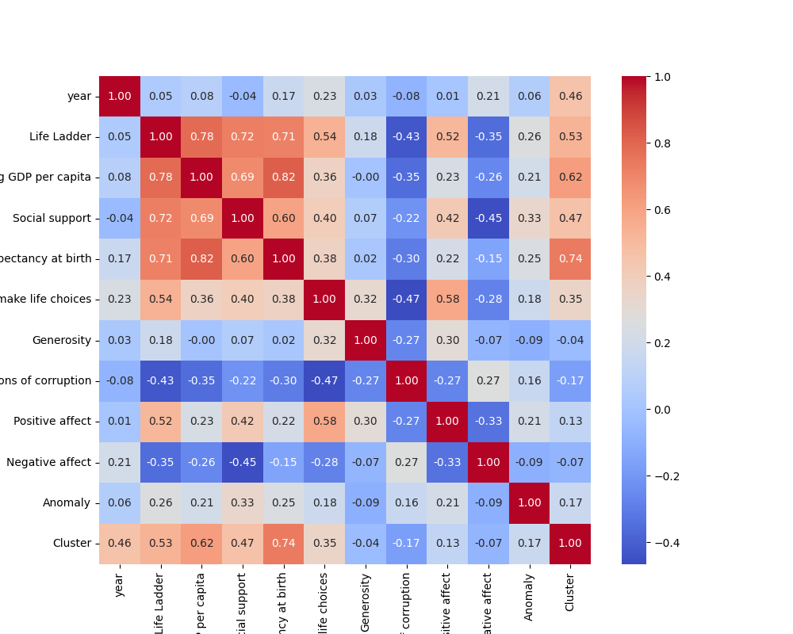
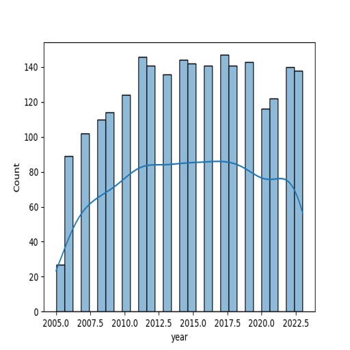
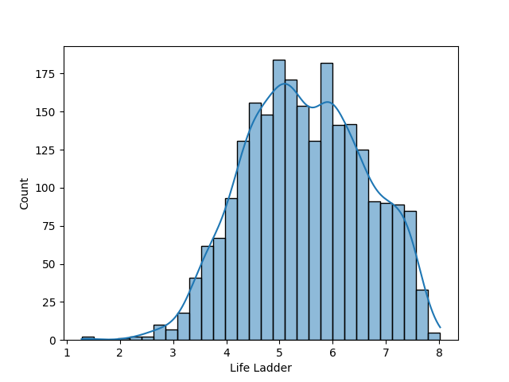
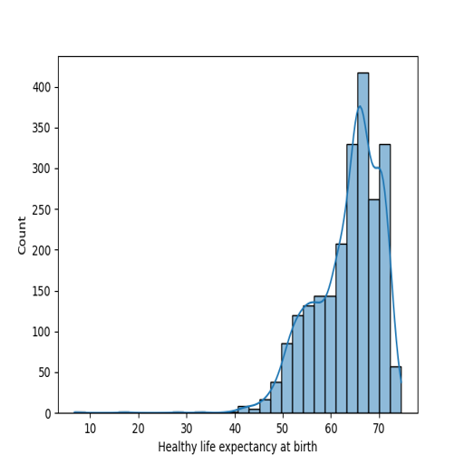
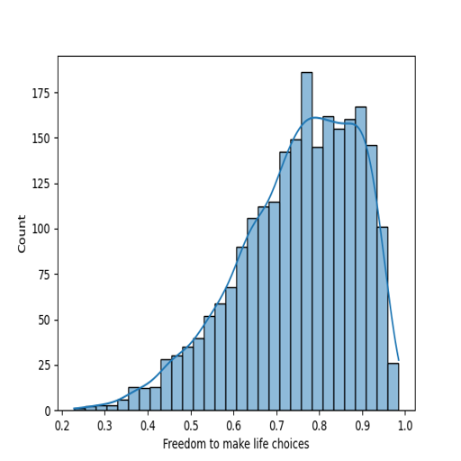
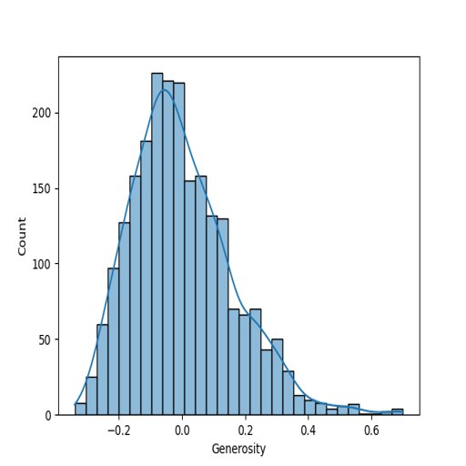
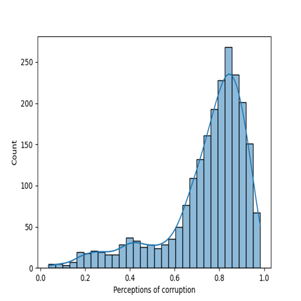
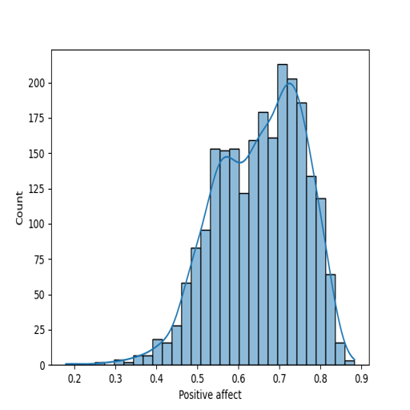

# Automated Data Analysis

### Dataset Analysis Report

#### 1. Dataset Overview
The dataset comprises diverse measures of well-being across 165 countries collected from multiple years (2005 to 2023). Its primary objective is to evaluate factors influencing quality of life and happiness, as indicated by the variable "Life Ladder," which likely reflects subjective well-being. Each observation includes the following variables: 

- **Country name**: The name of the country (categorical).
- **year**: The year of the observation (integer).
- **Life Ladder**: A measure of subjective well-being (float).
- **Log GDP per capita**: A logarithmic transformation of GDP per capita (float).
- **Social support**: The perceived support from friends and family (float).
- **Healthy life expectancy at birth**: Average years a newborn is expected to live in good health (float).
- **Freedom to make life choices**: A measure of personal autonomy (float).
- **Generosity**: A measure of charitable behavior (float).
- **Perceptions of corruption**: The degree to which corruption is perceived in government and business (float).
- **Positive affect**: The extent to which individuals feel positive emotions (float).
- **Negative affect**: The extent to which individuals feel negative emotions (float).

This structure facilitates studying the interplay among socioeconomic factors, psychological well-being, and health metrics across time and geography.

#### 2. Exploratory Analysis
Before deriving insights, a thorough exploratory analysis was conducted, which revealed a range of data quality issues:

- **Missing Values**: Several variables have missing values, notably:
  - **Generosity**: 81 missing.
  - **Perceptions of corruption**: 125 missing.
- **Data Completeness**: 
  - The count of observations varies across variables, with "Log GDP per capita" missing 28 entries and "Healthy life expectancy" missing 63. The changes in data points suggest variability in data collection methodologies across years or countries.
- **Duplicates**: There are no indications of duplicate entries based on country and year.
  
Given these observations, methods including descriptive statistics and data visualization (boxplots, histograms) were employed to characterize the distributions and identify potential outliers.

#### 3. Feature Relationships
Correlation analysis among variables highlighted several significant relationships:

- **Life Ladder and Log GDP per capita**: A positive correlation (mean: ~9.40) suggests a trend where higher GDP contributes to increased subjective well-being.
- **Social support and Life Ladder**: Also positively correlated, implies that social connectedness plays a crucial role in perceived happiness.
- **Negative affect and Life Ladder**: A negative correlation indicating that lower levels of negative emotions are associated with higher happiness levels.

Unexpected relationships included a weak correlation between "Freedom to make life choices" and "Generosity," despite the intuitive belief that generous societies may value freedom.

#### 4. Key Insights
Several key findings emerged from the analysis:

- Countries with high GDP per capita and robust social support systems generally score higher on the Life Ladder metric.
- Healthy life expectancy positively influences overall happiness, highlighting the interconnectedness of health and mood.
- There are noticeable regional disparities; wealthier regions tend to have larger gaps in life satisfaction than poorer regions.

#### 5. Implications
The insights suggest that policies aimed at enhancing economic growth, improving social support, and increasing health benefits can significantly impact happiness levels. Recommendations include:

- Prioritizing social welfare programs that strengthen community ties and mental health support.
- Implementing economic policies that address income inequality particularly in underperforming regions.

#### 6. Visualizations
- **Scatter Plots**: Correlations between "Life Ladder" and "Log GDP per capita" and "Social support" were highlighted in scatter plots to illustrate relationships visually.
- **Boxplots**: Showing distributions of "Life Ladder" scores across different regions can help to understand disparities in subjective well-being.

These visualizations reinforce the understanding of relationships between the variables.

#### 7. Hypotheses
Based on the findings, several hypotheses for future research could be proposed:
- Does the influence of "Log GDP per capita" on "Life Ladder" vary significantly across different regions?
- Is there a causal link between "Social support" and "Mental health indicators" in contributing to higher "Life Ladder" scores?
- How do fluctuations in "Perceptions of corruption" affect overall happiness over time in different countries?

These queries can direct more granular analyses and provide further understanding of the complex drivers of quality of life globally.

