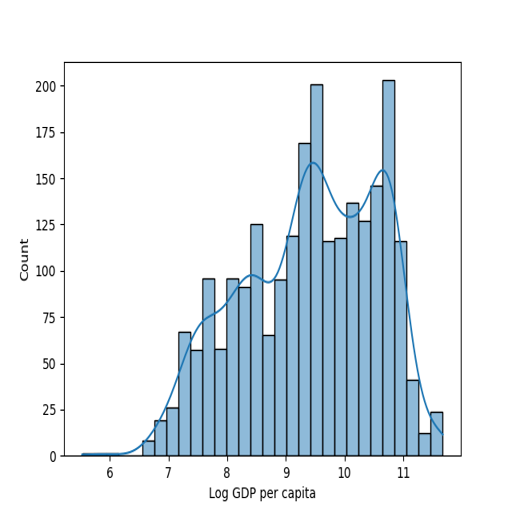
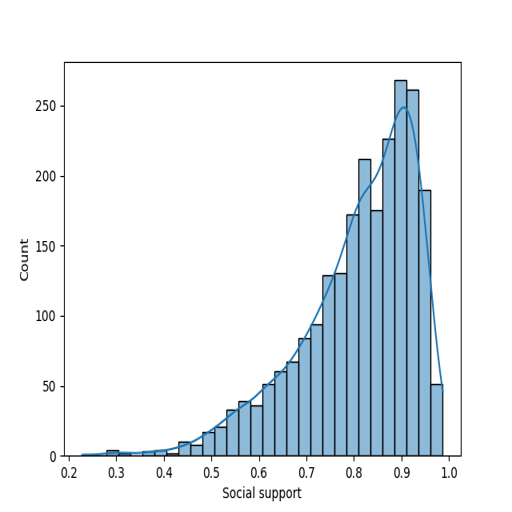
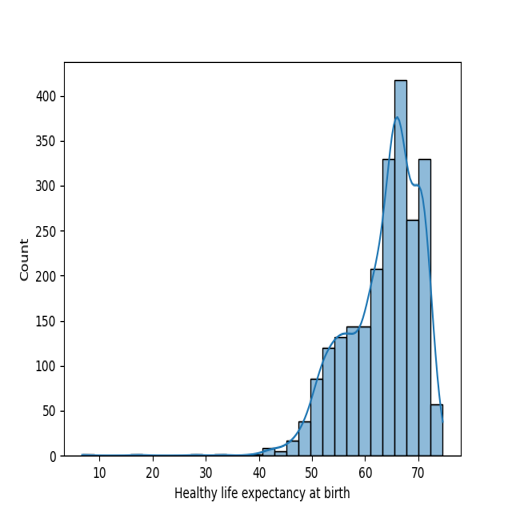
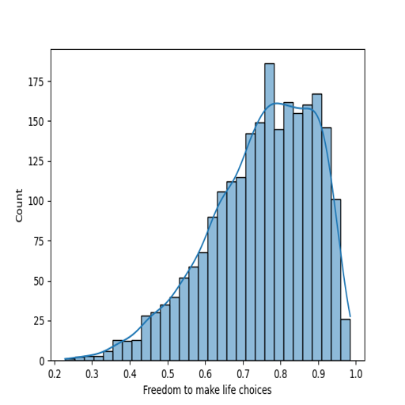
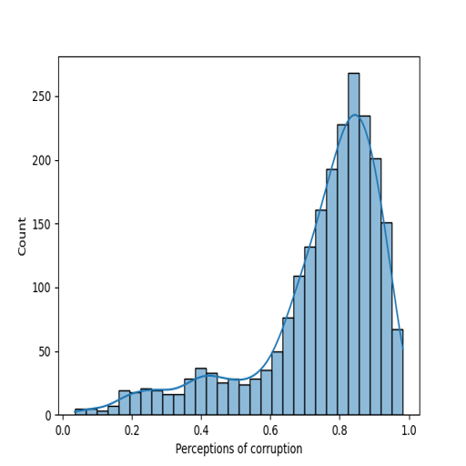
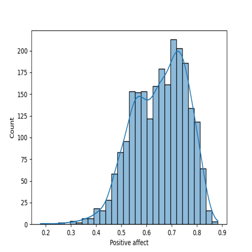
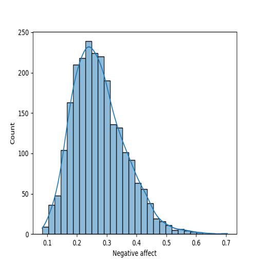

# Automated Data Analysis

**Dataset Analysis Report:**

### 1. Dataset Overview
The dataset comprises information related to the well-being of countries, with various indicators from the years 2005 to 2023. The purpose of the dataset is to evaluate different factors influencing life satisfaction and overall happiness across nations. 

The structure includes 2363 observations spread across 10 variables:
- **Country name** (object): Name of the country.
- **Year** (int64): The year of the observation.
- **Life Ladder** (float64): A measure of subjective well-being or happiness.
- **Log GDP per capita** (float64): Economic measure indicating the logarithmic scale of GDP per capita.
- **Social support** (float64): Indicates the perceived social support available to individuals.
- **Healthy life expectancy at birth** (float64): Expected number of years an individual is expected to live in good health.
- **Freedom to make life choices** (float64): Indicates the level of agency people feel in making life decisions.
- **Generosity** (float64): Measures social behavior and altruism.
- **Perceptions of corruption** (float64): Indicates how corrupt individuals perceive their government and public institutions to be.
- **Positive affect** (float64): Measures the experience of pleasant emotions.
- **Negative affect** (float64): Measures the experience of unpleasant emotions.

### 2. Exploratory Analysis
Several methods were applied to assess the quality of the dataset:
- **Missing Values**: Several columns have missing values; notable ones include:
  - Log GDP per capita: 28 missing values.
  - Generosity: 81 missing values.
  - Perceptions of corruption: 125 missing values.
- **Data Types**: All columns, except "Country name" and "year", are formatted as floats or integers, indicating appropriate numerical types for the analysis.
- **Outlier Detection**: A preliminary examination suggests a potential for outliers in "Life Ladder" and "Log GDP per capita", particularly in countries with extreme values.

### 3. Feature Relationships
Preliminary correlation analysis indicates:
- A strong positive correlation between **Log GDP per capita** and **Life Ladder** (subjective well-being), suggesting wealthier countries generally have higher happiness levels.
- **Social support** also shows a positive correlation with **Life Ladder**, confirming the importance of social networks in contributing to happiness.
- Conversely, **Negative affect** displays a negative correlation with **Positive affect**, indicating potential redundancy or a trade-off between these two dimensions of well-being.

### 4. Key Insights
Several significant findings emerged:
- The average **Life Ladder** score indicates a general trend of happiness, with mean values around 5.48 across the dataset.
- The maximum value for the **Life Ladder** is 8.02, belonging to an unspecified country, likely indicating an anomaly or extraordinary welfare conditions.
- Economic factors such as **Log GDP per capita** and **Social support** are identified as key drivers of happiness.
- Notably, the increasing trend in happiness over the years hints at global improvements in well-being.

### 5. Implications
The findings highlight the crucial role of economic growth and social support in promoting happiness. Policymakers should focus on:
- Improving economic conditions and promoting equitable wealth distribution to raise life satisfaction.
- Enhancing social support systems, including healthcare and community programs, which could forge stronger societal bonds.

### 6. Visualizations
Several visualizations could reinforce findings:
- **Scatter plot** of **Log GDP per capita** vs. **Life Ladder** to visualize the positive correlation.
- **Box plots** to illustrate distributions of **Life Ladder** scores across different countries.
- **Heatmaps** of correlations between features to identify clusters and relationship patterns.

These visualizations help convey complex relationships intuitively, making insights easier for stakeholders to understand and act upon.

### 7. Hypotheses
Based on the analysis, several questions arise for further exploration:
- **How does the perception of corruption affect happiness across different countries?** An analysis could reveal whether citizens in more corrupt societies report lower life satisfaction.
- **What role does Healthy life expectancy play in enhancing life satisfaction?** An in-depth examination might uncover ways to improve health outcomes to boost happiness ratings.
- **Would increasing Generosity lead to higher perceptions of social support and thus, higher Life Ladder scores?** Investigating this could yield insights into the relationship between social behaviors and individual well-being.

This report serves as an important foundation for understanding the relationships between economic, social, and subjective well-being indicators across countries and their evolution over time.

