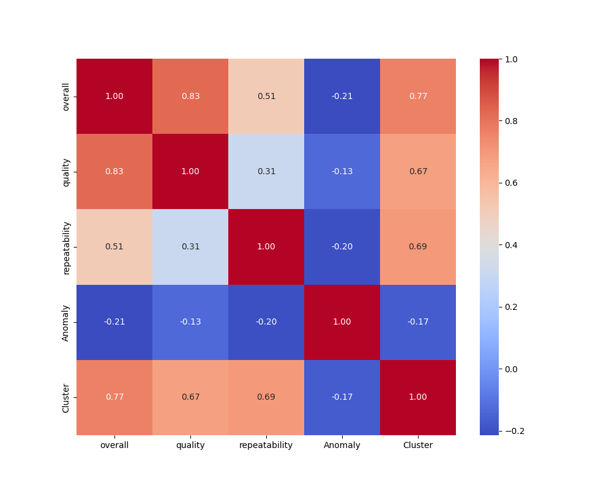
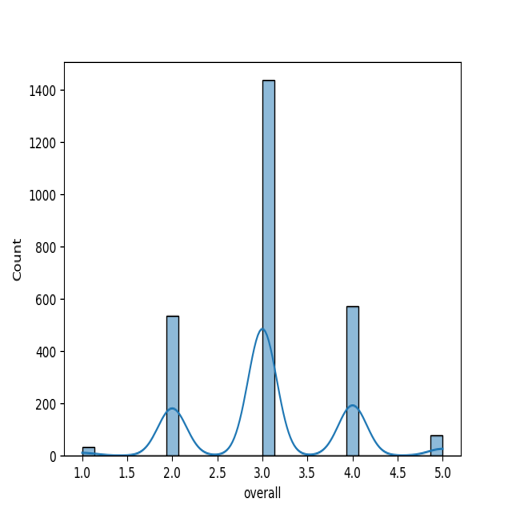
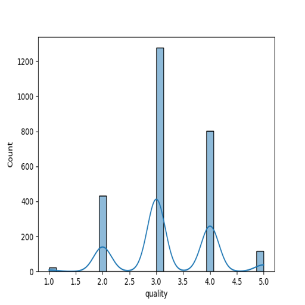
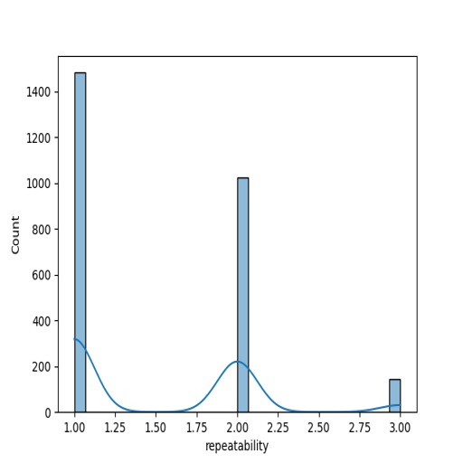
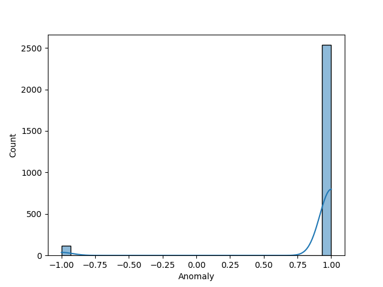
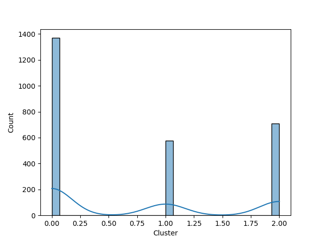

# Automated Data Analysis

### Dataset Analysis Report

#### 1. Dataset Overview
The dataset comprises 2,652 entries, spanning a diverse range of 11 different languages and 8 unique types. The predominant language is English, with 1,306 instances, and the most common type is "movie" with 2,211 occurrences. The date range within the dataset extends from June 18, 2005, to November 15, 2024. Key features include qualitative metrics like overall ratings (on a scale likely ranging from 1 to 10) and quality ratings, as well as categorical features like language, type, and the title of the entries. The repeatability of the measurements appears to range from 1 to 3, while anomaly detection scores range between -1 and 1, indicating a structured approach to assessing data reliability.

#### 2. Outliers and Anomalies
The dataset displays some outliers and anomalies. The "Anomaly" column, with maximum values reaching 1, suggests that there were instances deemed problematic or unique when compared to the bulk of the data. The "repeatability" column, with a mean of approximately 1.49 and a range from 1 to 3, reveals that most of the records fall into a lower repeatability score, which might indicate consistency in measurements but could also suggest a need for deeper investigation into the high repeatability scores observed among some entries. The count of missing values indicates that there are 99 missing entries in the "date" column and 262 missing values in the "by" column, which could impact analysis and interpretations.

#### 3. Correlation, Regression, and Feature Importance
To gain insight into potential interrelationships, correlation analysis will reveal how features like overall ratings, quality, repeatability, and anomalies correlate with each other. A focus on the linear regression model can elucidate how well features explain overall ratings and whether language or type play a significant role. Feature importance ranking from machine learning models, such as random forests, can also highlight the key predictors of the overall rating quality, indicating which features hold the most predictive power.

#### 4. Time Series Patterns
With the date column represented as a datetime64 type, trends over time can be analyzed, particularly focusing on how ratings, type, and language variance might change over specific periods. Time series analysis can unveil seasonality or trends in the type of content released over the years, as well as how user ratings have evolved. For example, a rise in average quality ratings over the years could suggest improving content quality.

#### 5. Cluster Analysis Findings
The dataset features a clustering column, with significant counts in different clusters. Analyzing clusters will reveal patterns of similarity and divergence among entries based on ratings, anomalies, or types. Clustering techniques such as K-Means or hierarchical clustering can categorize entries into natural groupings, allowing for targeted insights related to user preferences or common characteristics among high-rated entries in specific languages or types.

#### 6. Geographic Insights
Although the dataset does not explicitly include geographic information, the analysis could potentially consider the language as a proxy for origin (e.g., content popular in English-speaking countries). Recommendations would be to incorporate geographical data if available, allowing for more nuanced exploration of trends and preferences across different regions, which could enrich the analysis significantly.

#### 7. Network Analysis Observations
Network analysis may not apply directly due to the nature of the dataset; however, insights could emerge from the interactions between different features. For example, analyzing the relationships between different types and languages, or how certain titles correlate with their creators (denoted in the "by" column), might yield interesting patterns. Social network analysis could also be performed if there are relationships between titles or authors, mapping out connections based on shared language or rating trends.

### Conclusion
The dataset provides a rich landscape for analysis with its diverse features and temporal data. While there are areas needing attention—especially emanating from missing values and outliers—the insights extracted can help understand trends in media content across languages and types. By diving deep into correlation analysis, cluster findings, and investigating temporal changes, the dataset has the potential to provide valuable insights into user preferences and media consumption patterns.

